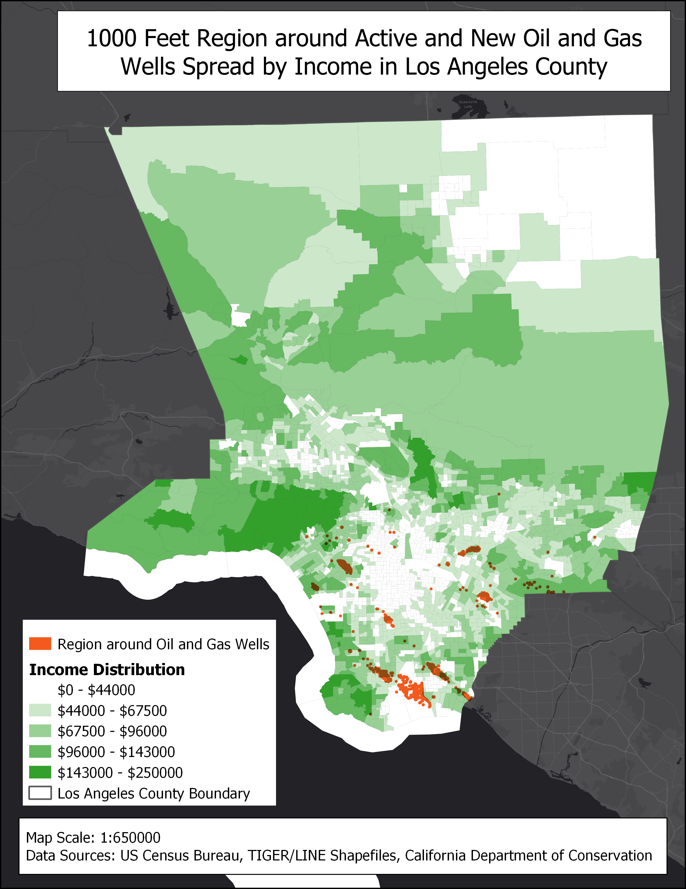
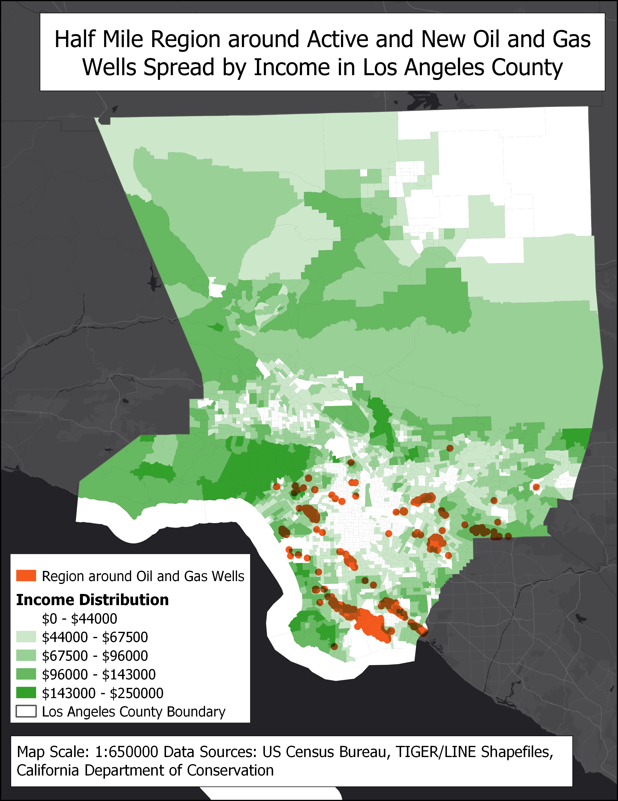
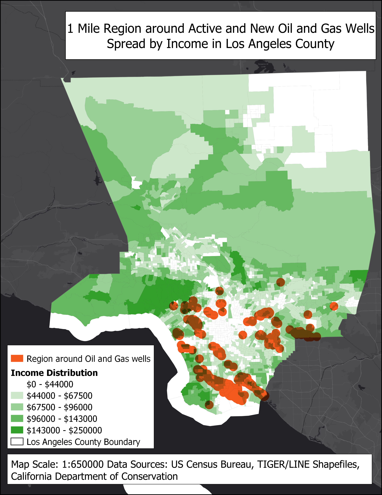

# Analysis of Conseuqences of Oil and Gas Extraction using GIS

## Introduction

The state of Colorado [prohibits oil and gas extraction](https://www.nytimes.com/2018/05/31/us/colorado-fracking-debates.html) 500 feet or closer to a residence and 1000 feet or closer to a school.

The Trump administration has made several claims to expand oil drilling and fracking in California, a move that [California
lawmakers aim to combat] (https://www.latimes.com/california/story/2019-09-09/california-lawmakers-block-trump-oil-drilling-fracking).

The objectives of this analysis is to understand which schools are closest to oil and gas extraction sites and thus, are at a higher risk of exposure. Additionally, I also analyze the impact of income and the likelihood of a public school being closer to an extraction site.

The following is a map of oil and gas wells in Los Angeles County:

## Public Schools Near Oil and Gas Wells

In Los Angeles county, there are no schools there are less than 500 feet close to a public school.
However, there are about 256 public schools that are closer than a 1000 feet to an oil and gas well.

Total Number of Public Schools in Los Angeles County: 1974

| Schools that are: 				| Number of Schools | % of Total Schools |
|-----------------------------------|-------------------|--------------------|
| Within a 1000 Feet of an Oil Well | 256               | 12.97%             |
| Within a Half Mile of an Oil Well | 730               | 48.07%             |
| Within One Mile of an Oil Well    | 1218              | 77.36%             |

1000 Feet Region Around Oil and Gas Wells:

Half Mile Region Around Oil and Gas Wells:

Mile Around Oil and Gas Wells:

#### Oil and Gas Wells Near Public Schools

There are about 1,664 oil and gas wells that are within a 1000 feet of a public school.

Total Number of Oil and Gas Wells in Los Angeles County: 21259

| Oil Wells that are:            | Number of Wells   | % of Total Wells   |
|--------------------------------|-------------------|--------------------|
| Within a 1000 Feet of a school | 1664              | 7.83%              |
| Within a Half Mile of a school | 8091              | 38.06%             |
| Within One Mile of a school    | 16067             | 75.58%             |

## Schools Near New or Active Oil and Gas Wells

The above numbers while helpful, present only half the picture. 
The regulation in Colorado is applicable only to active or new extraction sites, as sites that are buried, idle or abandoned do not carry the potential for harm.
Thus, considering solely extraction sites that are active or new, we get the following picture: 

Total Number of Active or New Oil and Gas Wells: 4130

| Schools that are: 				| Number of Schools | % of Total Schools |
|-----------------------------------|-------------------|--------------------|
| Within a 1000 Feet of an Oil Well | 27                | 1.38%              |
| Within a Half Mile of an Oil Well | 121               | 6.13%              |
| Within One Mile of an Oil Well    | 310               | 15.70%             |

1000 Feet Region Around Oil and Gas Wells:

Half Mile Region Around Oil and Gas Wells:

Mile Region Around Oil and Gas Wells:

## Hydraulic Fracturing

The most debatable methodology of extraction is hydraulic fracturing or "fracking".
The following is the list of schools that lie within a mile of such sites and are thus, particularly at risk:

| fid                          | District            | School                                        | Street                                    | City        | Zip        | State | Type                            | Latitude  | Longitude  |
|------------------------------|---------------------|-----------------------------------------------|-------------------------------------------|-------------|------------|-------|---------------------------------|-----------|------------|
| Culver City Unified District |                     |                                               |                                           |             |            |       |                                 |           |            |
| 219                          | Culver City Unified | El Rincon Elementary                          | 11177 Overland Ave.                       | Culver City | 90230-5454 | CA    | Elementary                      | 33.994836 | -118.39041 |
| Long Beach Unified District  |                     |                                               |                                           |             |            |       |                                 |           |            |
| 473                          | Long Beach Unified  | Chavez Elementary                             | 730 West Third St.                        | Long Beach  | 90802-2745 | CA    | Elementary                      | 33.770252 | -118.18293 |
| 483                          | Long Beach Unified  | California Academy of Mathematics and Science | 1000 East Victoria St., Bldg. SAC3 rm3117 | Carson      | 90747-0001 | CA    | High School                     | 33.867124 | -118.25869 |
| 529                          | Long Beach Unified  | Stevenson Elementary                          | 515 Lime Ave.                             | Long Beach  | 90802-2642 | CA    | Elementary                      | 33.773254 | -118.18371 |
| 543                          | Long Beach Unified  | Franklin Classical Middle                     | 540 Cerritos Ave.                         | Long Beach  | 90802-1623 | CA    | Intermediate/Middle/Junior High | 33.773406 | -118.17793 |
| Los Angeles Unified District |                     |                                               |                                           |             |            |       |                                 |           |            |
| 646                          | Los Angeles Unified | George De La Torre Jr. Elementary             | 500 North Island Ave.                     | Wilmington  | 90744-5524 | CA    | Elementary                      | 33.775424 | -118.26596 |
| 669                          | Los Angeles Unified | Magnolia Science Academy 3                    | 1254 East Helmick St.                     | Carson      | 90746-3164 | CA    | Elementary-High Combination     | 33.85163  | -118.24958 |
| 740                          | Los Angeles Unified | Phineas Banning Senior High                   | 1527 Lakme Ave.                           | Wilmington  | 90744-1526 | CA    | High School                     | 33.794039 | -118.26077 |
| 775                          | Los Angeles Unified | Avalon High                                   | 1425 North Avalon Blvd.                   | Wilmington  | 90744-1506 | CA    | High School                     | 33.791884 | -118.2634  |
| 852                          | Los Angeles Unified | Annalee Avenue Elementary                     | 19410 South Annalee Ave.                  | Carson      | 90746-2687 | CA    | Elementary                      | 33.854838 | -118.25296 |
| 878                          | Los Angeles Unified | Broadacres Avenue Elementary                  | 19424 South Broadacres Ave.               | Carson      | 90746-2710 | CA    | Elementary                      | 33.854531 | -118.24027 |
| 978                          | Los Angeles Unified | Fries Avenue Elementary                       | 1301 Fries Ave.                           | Wilmington  | 90744-2510 | CA    | Elementary                      | 33.788723 | -118.26557 |
| 999                          | Los Angeles Unified | Gulf Avenue Elementary                        | 828 West L St.                            | Wilmington  | 90744-3310 | CA    | Elementary                      | 33.786538 | -118.27208 |
| 1245                         | Los Angeles Unified | Wilmington Park Elementary                    | 1140 Mahar Ave.                           | Wilmington  | 90744-3815 | CA    | Elementary                      | 33.785999 | -118.24571 |
| 1337                         | Los Angeles Unified | Glenn Hammond Curtiss Middle                  | 1254 East Helmick St.                     | Carson      | 90746-3164 | CA    | Intermediate/Middle/Junior High | 33.85163  | -118.24958 |

## Impact of Income

It is interesting to note external factors like income and race that may affect the location of schools and may place them closer
to extraction sites.

In the case of Colorado, [a fracking site closer to a school with a higher white population was moved to a location much closer to 
a school with a greater Black and Hispanic population]. (https://www.nytimes.com/2018/05/31/us/colorado-fracking-debates.html)
There may have been an underlying assumption that the community will not have the resources to fight the move.

In the case of Los Angeles county, I have analyzed the impact of income.

There are 27 schools that are within a 1000 feet of an active or new oil well in Los Angeles County. Of these, 
about 52% are in low-income areas

| Median Household Income | Number of Schools | Percentage |
|-------------------------|-------------------|------------|
| Less than $67,500 	  | 14/27			  | 51.85%	   |
| Less than $96,000		  | 25/27			  | 92.60%	   |

There are 121 schools that are within a hald mile of an active or new oil well in Los Angeles County. Of these, 
about 62% are in low-income areas

| Median Household Income | Number of Schools | Percentage |
|-------------------------|-------------------|------------|
| Less than $67,500 	  | 75/121			  | 61.98%	   |
| Less than $96,000		  | 110/121			  | 90.90%	   |

There are 310 schools that are within a hald mile of an active or new oil well in Los Angeles County. Of these, 
about 64% are in low-income areas

| Median Household Income | Number of Schools | Percentage |
|-------------------------|-------------------|------------|
| Less than $67,500 	  | 197/310			  | 63.55%	   |
| Less than $96,000		  | 280/310			  | 90.32%	   |

Thus, we can see a loose correlation between the median income of a locality and its likelihood to have a public school
closer to an oil and gas extraction site.

(Note: For the purposes of this assignment, Catalina island has been ignored as there are no extraction sites present there.)
(Note: Smaller images of maps are present in the report for readability, but all the maps in full view are attached to the end of the assignment)

## Methodology

This project employed several techniques that have been discussed with the progression of this class:

1. I conducted some research and read up on the state laws of Colorado and California to understand a broader picture about the issue.
GIS is most effective if techniques are employed with the right questions in mind. This process allowed me to ask relevant questions.

2. Public Schools Near Oil Wells: 
I created these maps using buffers around oil wells, setting the radius appropriately to a 1000 feet, 0.5 mile, and 1 mile.
To find the number of schools within these buffers, I used the "Select by location" tool and selected the public schools
within these ranges.
The percentages were found using simple arithmetic on the basis of the total number of schools (which was found by simply opening the attribute table, which displays the total number of features on top)

3. Oil Wells Near Public Schools:
I employed similar methodologies as above, except I simply inverted the layers I applied the operations to.

4. Schools Near New or Active Oil and Gas Wells:
This step also employed similar strategies as above. However, it was preceded by filtering Oil and Gas Wells that were Active or New.
This was done by setting the Filter for 
	"Type" LIKE 'A' OR "Type" LIKE 'N'

5. Hydraulic Fracturing
This step also employed filtering, where the HydFrac property was set to Yes or 'Y'.
Then, the corresponding attribute table was exported as an Excel file (.xlsx)

6. Impact of Income
I imported the layer with information of median household Income.
Then, under Symbology, I changed the symbol to be Graduated, asjusted the Color Ramp, and classfied based on the income value. I used "Natural Breaks" and cleaned up the values by changing them marginally.
Once this was accomplished, I filtered income twice for each of the tables, once to be less than $67,500 and once to be less than $96,000.
Then I selected public schools within each of the corresponding 1000 feet, 0.5 mile and 1 mile buffers using the "Selec by location" tool.
To further select such schools that lied within the filtered income layer, I changed the selection parameter "Modify current selection by" from "create a new selection" to "selection within current selection". This ensured that only those fields that lied within the buffer radius and within the income threshold were selected.

